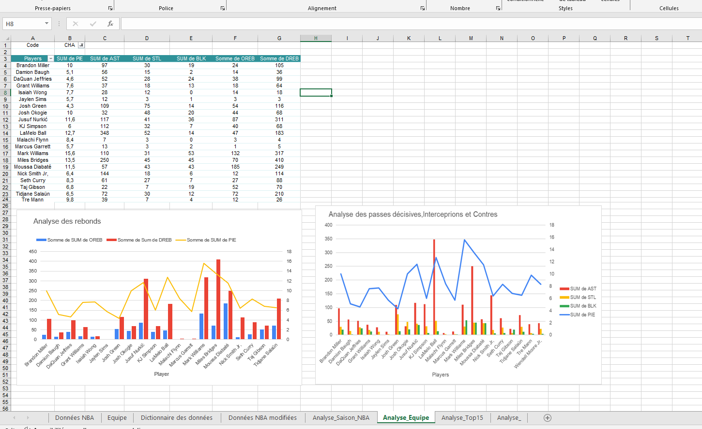
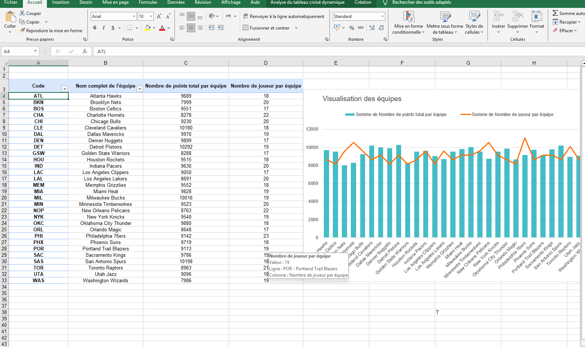
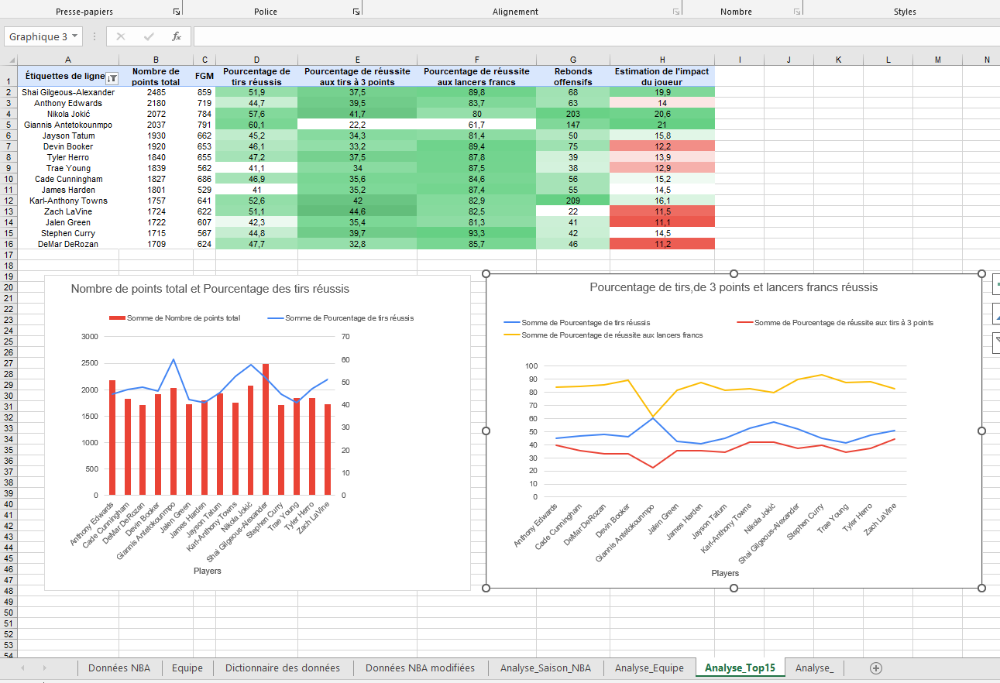
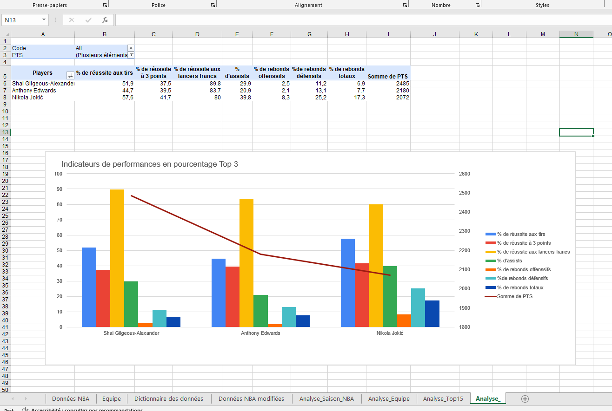

## 🎯 Objectif

Analyser les performances des joueurs NBA à partir de données statistiques afin d’identifier les joueurs les plus performants et de comparer leurs résultats.

## 🏢 Contexte

Ce projet consiste à exploiter des données statistiques NBA afin de réaliser différentes analyses sur les performances des joueurs.

L’objectif est de transformer les données brutes en informations utiles grâce à Excel et à des visualisations adaptées.

## 🛠️ Outil utilisé

- Microsoft Excel

## 🔎 Méthodologie

- Importation et préparation des données
- Exploration des données statistiques
- Organisation et nettoyage des données
- Utilisation de fonctions et formules Excel
- Création de tableaux croisés dynamiques
- Calcul d'indicateurs de performance
- Création de graphiques
- Analyse et interprétation des résultats

## 📊 Analyses réalisées

- Analyse des performances par joueur
- Analyse des statistiques de rebonds
- Analyse des passes décisives
- Analyse des interceptions
- Analyse des contres
- Comparaison des performances des joueurs
- Analyse des statistiques selon les différentes saisons

## 📈 Résultats

L’analyse permet de comparer les performances des joueurs et d’identifier les principaux indicateurs statistiques.

Les tableaux et graphiques facilitent la lecture des données et permettent de mettre en évidence les différences de performance entre les joueurs.

### Analyse par équipe

### Analyse de la saison NBA

### Top 15 des joueurs

### Autres analyses

## 📁 Fichiers du projet

- 📊 [Rapport d'analyse Excel](./Bouskour_Iman_1_rapport_d'analyse_022026.xlsx)
- 📑 [Présentation du projet](./Bouskour_Iman_2_Presentation_022026.pptx)
- 📁 [Toutes les captures](./Images/)

## 💡 Conclusion

Ce projet m’a permis de mettre en pratique Excel pour préparer, analyser et visualiser des données statistiques, tout en développant une approche structurée d’analyse de données.

