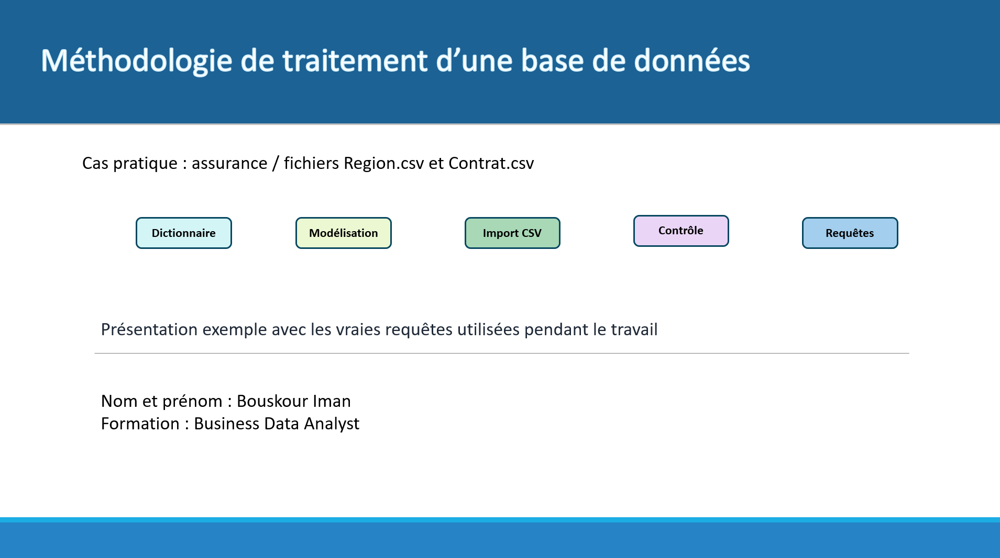
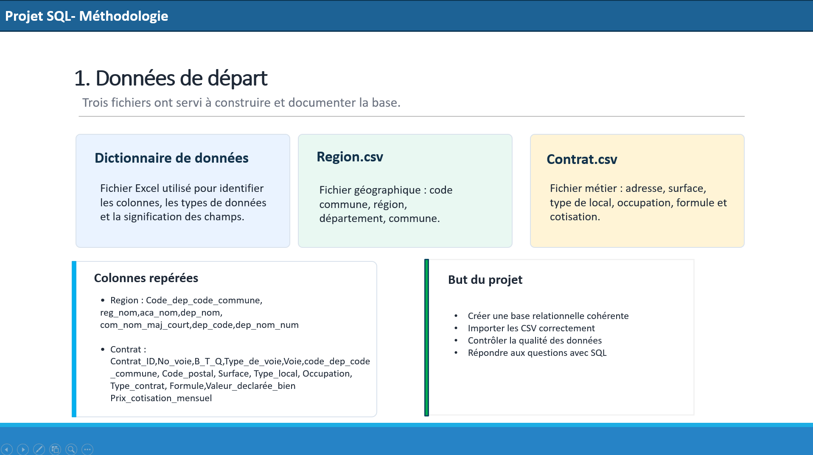
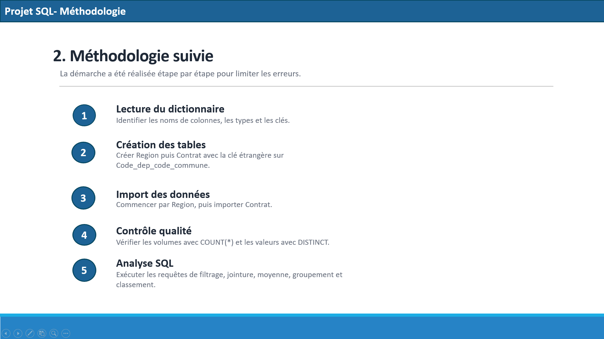
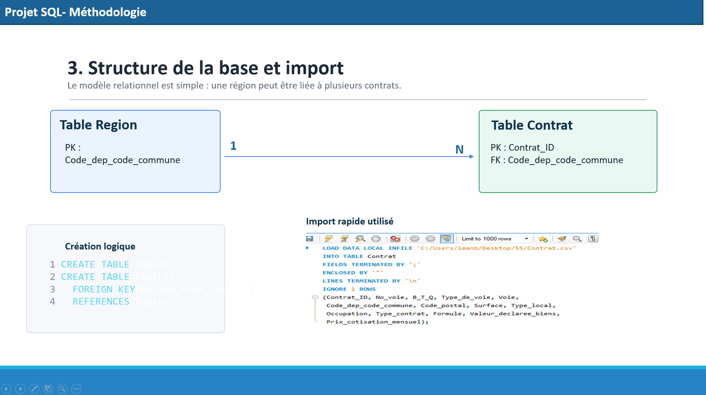

 🏠 Analyse de données d’assurance habitation avec SQL

## 🎯 Objectif

Analyser des contrats d’assurance habitation afin d’identifier des tendances, des indicateurs clés et des informations utiles à la prise de décision.

## 🛠️ Outil utilisé

- SQL

## 📊 Contexte

La base de données est composée de deux tables principales : **Contrat** et **Region**.

L’objectif est d’exploiter ces données afin d’analyser les caractéristiques des logements ainsi que leur répartition géographique.

## 🔎 Méthodologie

- Création et structuration de la base de données
- Mise en place des clés primaires et étrangères
- Jointure des tables **Contrat** et **Region**
- Nettoyage et préparation des données
- Utilisation de requêtes SQL pour analyser les données
- Calcul d’indicateurs statistiques
- Segmentation, classement et tri des résultats

## 📈 Analyses réalisées

- Calcul du prix moyen des cotisations
- Identification des contrats avec les surfaces les plus élevées
- Analyse du nombre de contrats par région
- Analyse des contrats selon le type de logement
- Identification des zones présentant une forte concentration de contrats

## 💡 Résultats

- Mise en évidence des régions avec le plus grand nombre de contrats
- Identification des facteurs pouvant influencer le prix des cotisations
- Analyse des caractéristiques des logements les plus représentés
- Production d’informations utiles à l’analyse et à la prise de décision

## 📸 Aperçu du projet

### Analyse des données

### Résultats SQL

### Analyse des contrats

### Analyse géographique

## 📁 Fichiers du projet

- 📄 [Document technique](./Bouskour_Iman_1_document%20technique_032026.pdf)
- 💻 [Requêtes SQL](./Bouskour_Iman_2_liste_032026.pdf)
- 📊 [Méthodologie](./Bouskour_Iman_3_méthodologie_032026.ppsx)

## 📷 Toutes les captures

[Voir toutes les captures du projet](./Images/)

## ✅ Conclusion

Ce projet m’a permis de mettre en pratique SQL pour exploiter une base de données, effectuer des analyses et transformer les données en informations utiles à la prise de décision.
