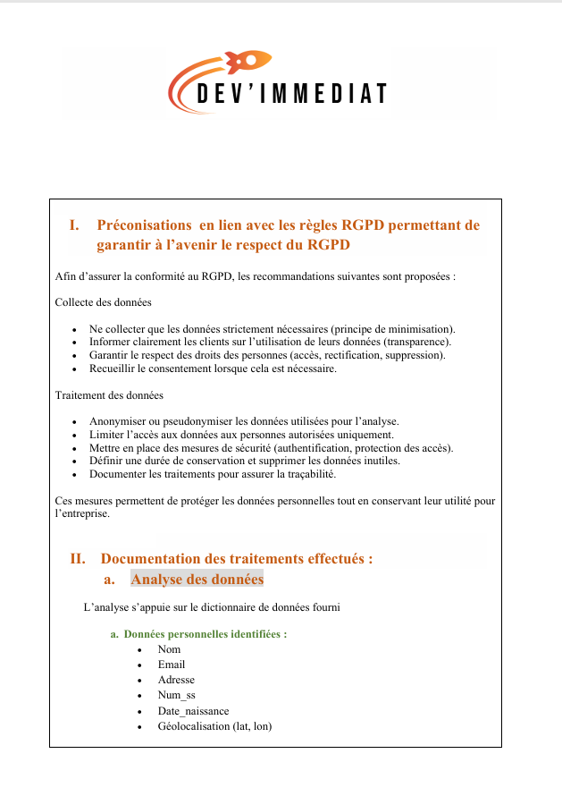
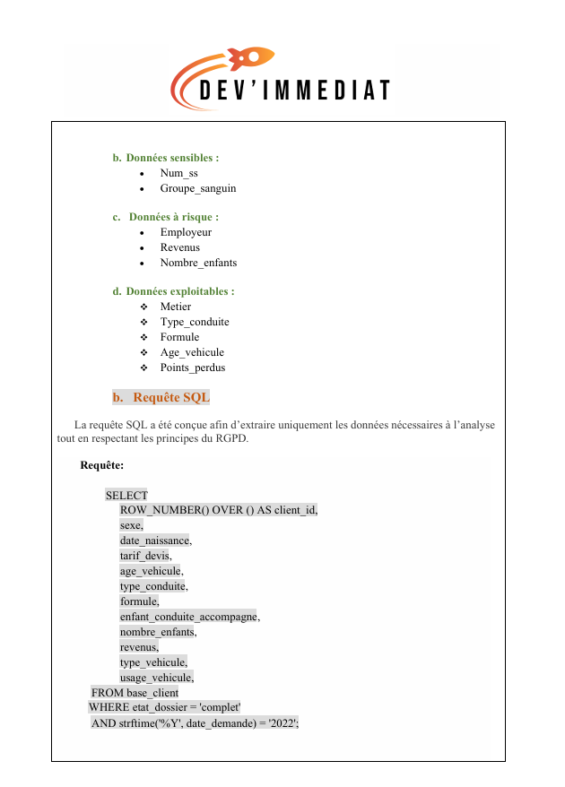
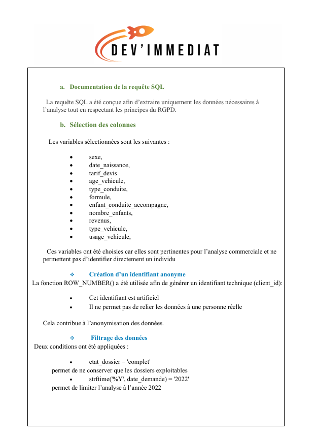
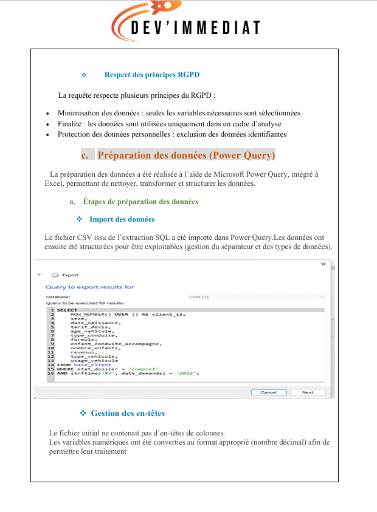
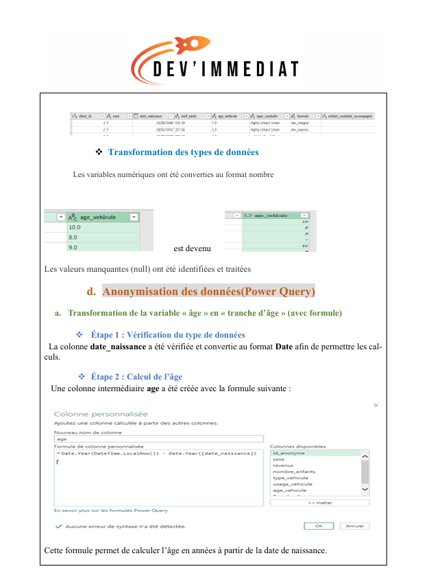
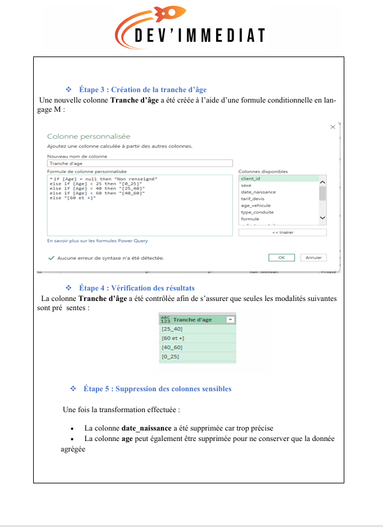
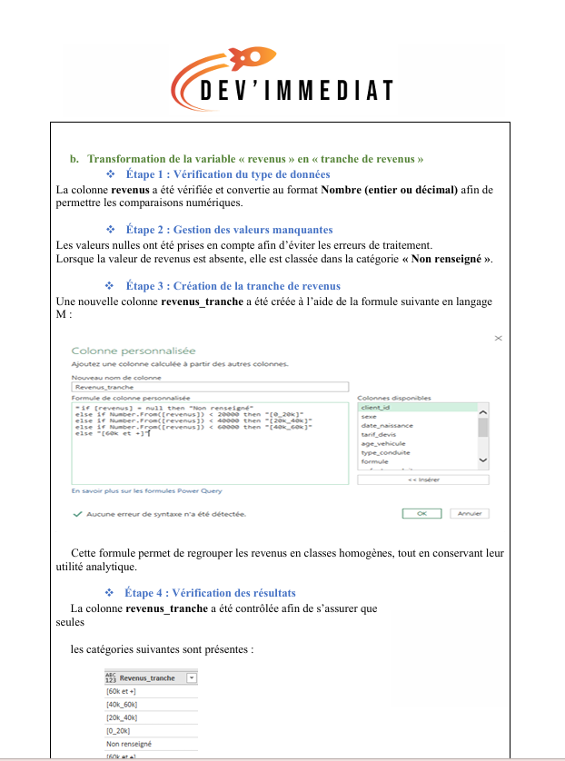
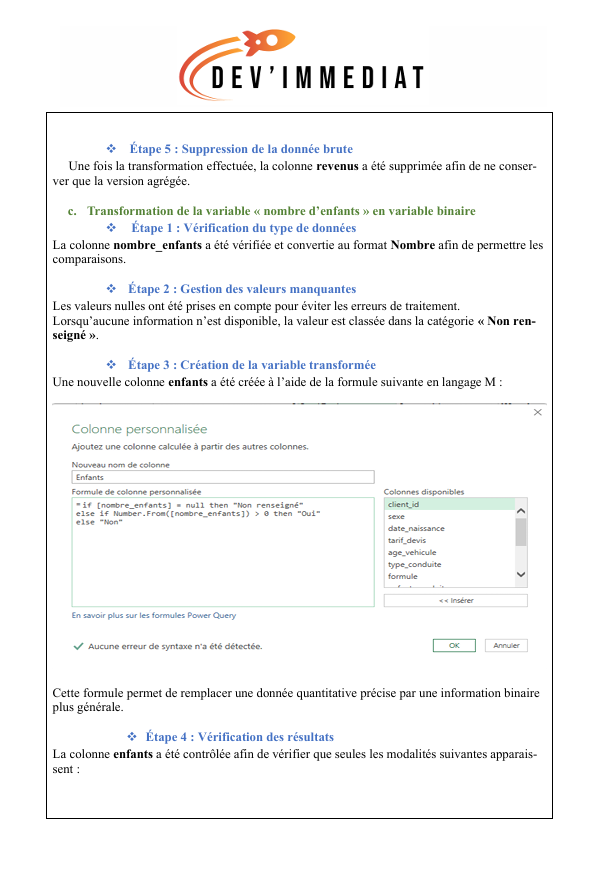
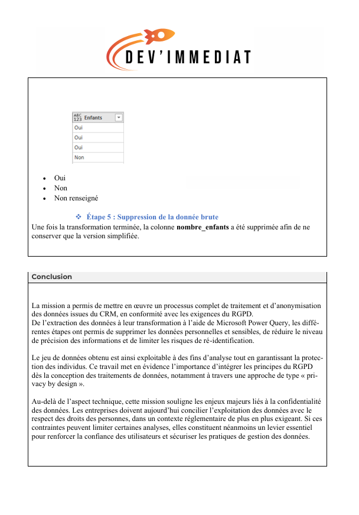

# 🔐 Collecte et traitement des données dans le respect du RGPD

## 🎯 Objectif

Ce projet consiste à retraiter une base de données issue d’un CRM afin de garantir
la conformité avec le Règlement Général sur la Protection des Données (RGPD).

L’objectif est de sélectionner les données nécessaires à l’analyse, de supprimer ou
transformer les données personnelles et sensibles, et de conserver la valeur
analytique des données tout en limitant les risques de ré-identification.

## 📌 Contexte

À la suite d’une sanction de la CNIL, l’entreprise doit démontrer sa conformité
au RGPD. Une mission a donc été réalisée afin de retravailler les données issues
du CRM et de garantir qu’elles ne permettent plus d’identifier directement ou
indirectement les clients. :chatgpt-content-reference{index="1"}

## 🛠️ Outils utilisés

- SQL
- Microsoft Power Query
- Excel
- Fichier CSV

## 🔎 Méthodologie

### 1. Analyse des données

Identification des différentes catégories de données :

- Données personnelles : nom, email, adresse, numéro de sécurité sociale,
  date de naissance et géolocalisation
- Données sensibles : numéro de sécurité sociale et groupe sanguin
- Données à risque : employeur, revenus et nombre d’enfants
- Données exploitables pour l’analyse : métier, type de conduite, formule,
  âge du véhicule et points perdus :chatgpt-content-reference{index="2"}

### 2. Extraction avec SQL

Une requête SQL a été utilisée afin de sélectionner uniquement les données
nécessaires à l'analyse.

Un identifiant technique anonyme a été créé avec `ROW_NUMBER()` et les données
ont été filtrées pour conserver uniquement les dossiers complets de l'année 2022. :chatgpt-content-reference{index="3"}

### 3. Préparation des données avec Power Query

Les données extraites ont ensuite été préparées avec Microsoft Power Query :

- Import du fichier CSV
- Gestion des en-têtes
- Transformation des types de données
- Traitement des valeurs manquantes
- Nettoyage et structuration des données :chatgpt-content-reference{index="4"}

### 4. Anonymisation

Plusieurs transformations ont été réalisées afin de réduire la précision des
données et limiter les risques de ré-identification :

- Transformation de l'âge en tranche d'âge
- Transformation des revenus en tranches
- Transformation du nombre d'enfants en variable binaire
- Suppression des données brutes après transformation :chatgpt-content-reference{index="5"} :chatgpt-content-reference{index="6"} :chatgpt-content-reference{index="7"}

## 📊 Résultats

Le traitement a permis d'obtenir un jeu de données exploitable pour l'analyse
tout en supprimant ou transformant les données personnelles et sensibles.

Le projet applique notamment les principes de :

- Minimisation des données
- Finalité du traitement
- Protection des données personnelles
- Limitation de la conservation
- Sécurité et transparence :chatgpt-content-reference{index="8"}

## 📸 Aperçu du projet

## 📁 Fichiers du projet

- 📄 [Rapport de traitement des données](./Bouskour_Iman_3_rapport_042026.pdf)
- 📄 [Préconisations RGPD](./Bouskour_Iman_1_recommandations_042026.pdf)

## ✅ Conclusion

Ce projet montre la mise en œuvre d’un processus de traitement et
d’anonymisation des données issues d’un CRM, depuis l’extraction SQL jusqu’à
la transformation avec Power Query.

