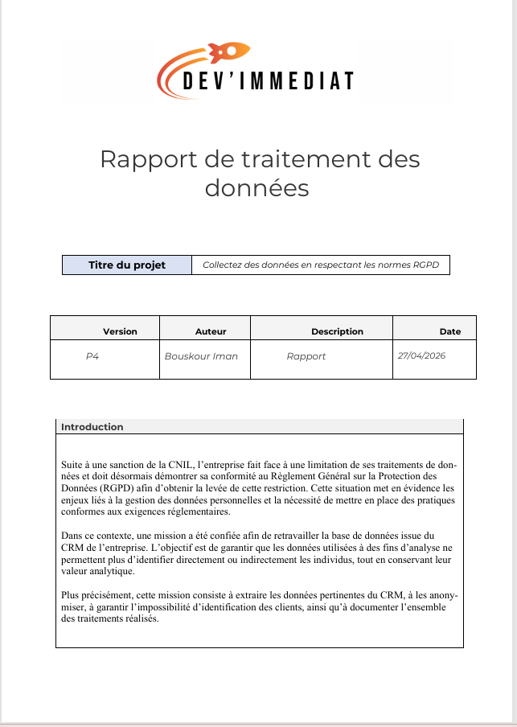

# 🔐 Analyse et traitement des données dans le respect du RGPD

## 🎯 Objectif

Analyser et traiter un jeu de données en appliquant les principes du RGPD, notamment la protection des données personnelles, leur anonymisation et leur utilisation de manière responsable.

## 🛠️ Outils utilisés

- Python
- Pandas
- Jupyter Notebook
- SQL

## 📊 Contexte

Ce projet porte sur l’analyse et le traitement de données dans un contexte de protection des données personnelles. L’objectif est d’identifier les données sensibles, de les anonymiser et de produire des analyses tout en respectant les principes du RGPD.

## 🔎 Méthodologie

- Identification des données personnelles
- Analyse de la structure et de la qualité des données
- Nettoyage et préparation des données
- Anonymisation des données sensibles
- Analyse des données
- Production de recommandations
- Prise en compte des principes du RGPD

## 📈 Résultats

- Identification des données nécessitant une protection particulière
- Mise en œuvre de méthodes d’anonymisation
- Analyse des données après traitement
- Formulation de recommandations pour une utilisation conforme et responsable des données

## 📸 Aperçu du projet

## 📁 Fichiers du projet

- 📄 [Rapport du projet](./Bouskour_Iman_3_rapport_042026.pdf)
- 📄 [Recommandations](./Bouskour_Iman_1_recommandations_042026.pdf)

