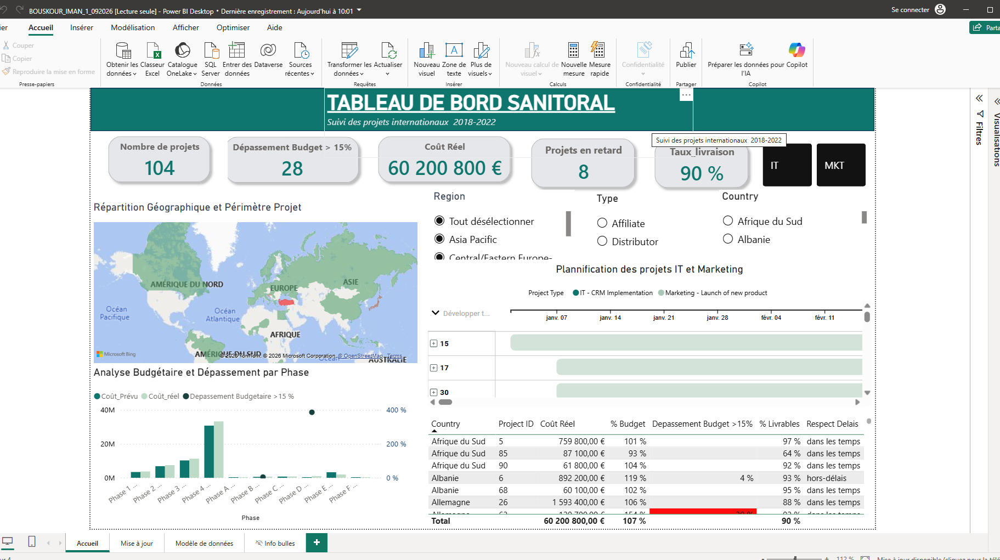
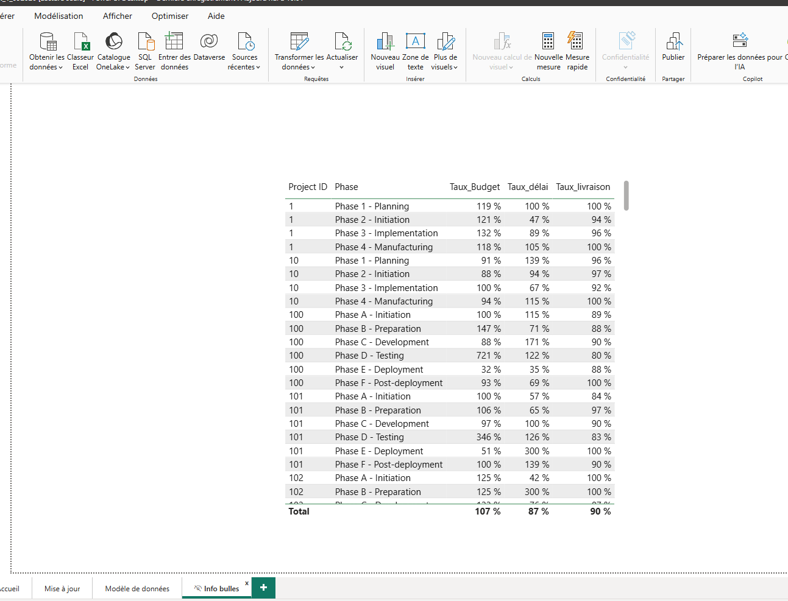
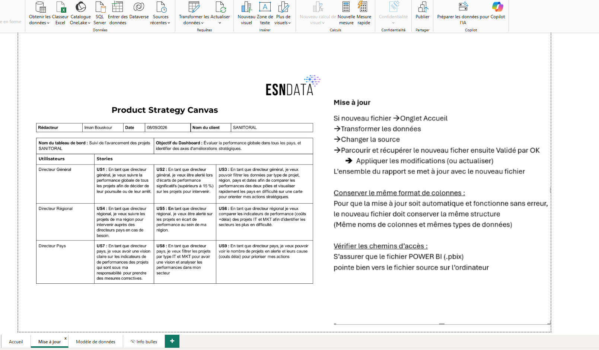
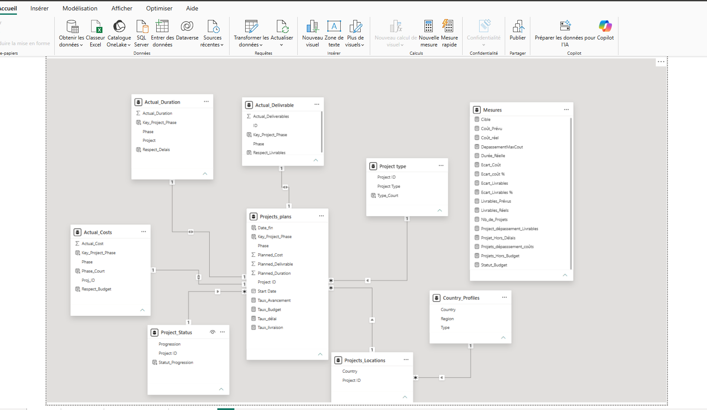

# 📊 Tableau de bord dynamique de suivi de projets avec Power BI

## 🎯 Objectif

Concevoir un tableau de bord interactif permettant de suivre l’avancement et la performance des projets, d’identifier les écarts et de faciliter la prise de décision.

## 🛠️ Outils

- Power BI
- Power Query
- DAX

## 🔎 Méthodologie

- Importation et nettoyage des données
- Transformation des données avec Power Query
- Création du modèle de données
- Mise en place des relations entre les tables
- Création de mesures avec DAX
- Création des indicateurs clés de performance (KPI)
- Analyse des coûts, délais et livraisons
- Identification des projets en alerte
- Conception d’un tableau de bord interactif

## 📈 Résultats

Le dashboard permet notamment de :

- Suivre la performance des projets
- Identifier les projets présentant des écarts
- Analyser les coûts et les délais
- Visualiser les indicateurs clés dans un tableau de bord interactif

## 📸 Aperçu du dashboard

### Vue d’accueil

### Informations et indicateurs

### Mise à jour

### Modèle de données

## 📁 Fichier du projet

📊 [Télécharger le fichier Power BI](./BOUSKOUR_IMAN_1_092026.pbix)
